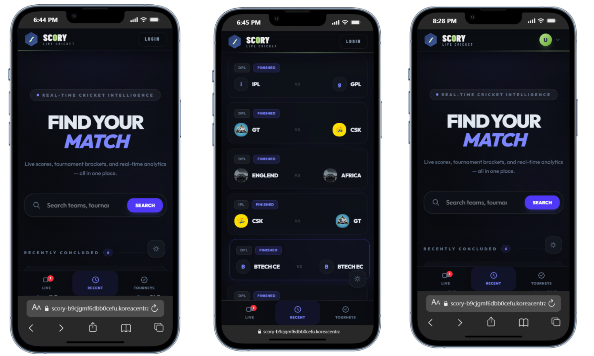
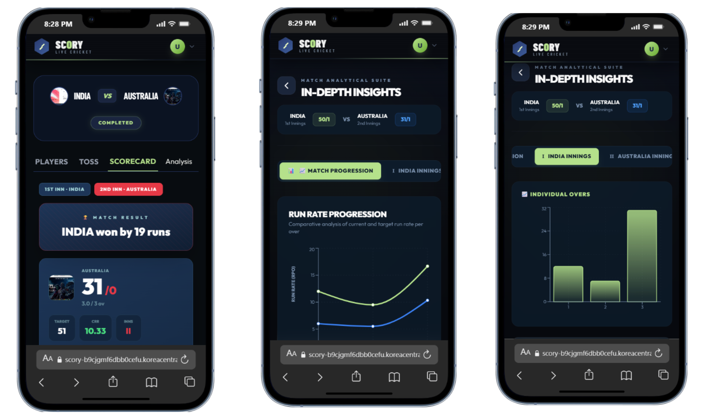

# Scory - Live Cricket Scores & Tournaments

***SCORY***

**Scory** is a modern, real-time web application built with Next.js that allows users to follow live cricket action, view completed matches, and explore tournaments. Get comprehensive stats, in-depth analysis, and real-time updates for every match.

## 🚀 Live Demos

We have deployed Scory on multiple platforms for high availability and performance testing. You can check out the live application here:

- **Vercel Deployment:** [https://scory-one.vercel.app/](https://scory-one.vercel.app/)
- **Azure Web App Deployment:** [https://scory-b9cjgmf6dbb0cefu.koreacentral-01.azurewebsites.net](https://scory-b9cjgmf6dbb0cefu.koreacentral-01.azurewebsites.net)(currently azure webapp server is stoped! )

## 📸 Screenshots

Here’s a glimpse of the application interface:

| Match Summary | Scorecard Details |
|---------------|-------------------|
|  |  |


## 🏗️ Architecture & Deployment

This project uses modern web development and deployment practices:

- **Frontend/Backend:** Built using **Next.js** (App Router), React, and Tailwind CSS.
- **Real-time Updates:** Powered by **Pusher** for live scoring updates.
- **Database:** PostgreSQL (using `pg` package).
- **Authentication:** Integrated with **Auth.js** (NextAuth).
- **CI/CD pipeline:** We use **GitHub Actions** to automate our deployment workflow directly to the **Azure Web App**.

## 🛠️ Tech Stack

- **Framework:** Next.js 14+
- **Styling:** Tailwind CSS
- **Real-time Engine:** Pusher
- **Database:** PostgreSQL
- **Charts:** Recharts
- **Image Hosting:** Cloudinary

## 💻 Running Locally

To get a local copy up and running, follow these simple steps.

1. **Clone the repo**
   ```bash
   git clone https://github.com/your_username/scory.git
   cd scory

2. **Install NPM packages**
   ```bash
   npm install
   ```

3. **Set up Environment Variables**
   Create a `.env.local` file in the root directory and add the necessary environment variables (Database URL, Pusher credentials, NextAuth secret, etc.).

4. **Run the development server**
   ```bash
   npm run dev
   ```

5. Open [http://localhost:3000](http://localhost:3000) to view it in the browser.

## 📝 Database Reset Commands

If you ever need to reset the scorecard data during development, you can use the following SQL command:
```sql
UPDATE innings SET total_runs = 0, total_wickets = 0, overs = 0 WHERE overs < 0 OR overs IS NULL;
```